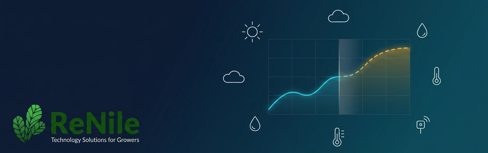

<p align="center">
  
</p>

## Weather Forecasting API

FastAPI service that returns current sensor values, the next 24 hourly forecast rows, and the next 7 daily min/max forecast rows for all sensor fields returned by ReNile-IOT using Chronos-2.

### Run

```bash
uv run uvicorn src.main:app --reload
```

### Endpoint

`POST /api/v1/forecast`

```json
{
  "JWT": "eyJhbGciOi...",
  "device_id": "681740b2b2b422389cd7831e"
}
```

The service calls ReNile-IOT with `data_type=month_hours`, `start_time` set to current time minus 20 days, and the request `device_id`. It interpolates hourly gaps, then uses only the last 14 days / 336 hourly rows as model context. Chronos predicts the next 7 days / 168 hourly rows. The request `JWT` is sent as `Authorization: JWT <token>`.

All sensor keys returned by ReNile-IOT are used as forecast targets dynamically. Column names are not mapped or filtered.

The response has three sections:

```json
{
  "current": {
    "time": "2026-06-16T10:00:00",
    "SO2": 24.0,
    "ambient_temp": 33.2
  },
  "hourly24": [
    {
      "time": "2026-06-16T11:00:00",
      "SO2": 25.1,
      "ambient_temp": 34.0
    }
  ],
  "daily7": [
    {
      "time": "2026-06-17",
      "SO2": {"min": 20.0, "max": 41.0},
      "ambient_temp": {"min": 27.5, "max": 40.2}
    }
  ]
}
```
